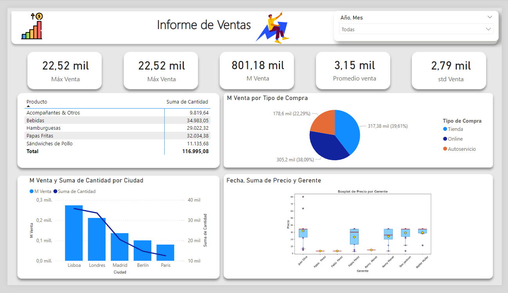

# Power BI Portfolio Showcase

This is a repository showcasing reports and data created in Power BI.

## Explanation of the analysis

The main goal of this project is to analyze the sales performance of a company using Power BI. Various sales amount measures were created and analyzed, such as maximum, minimum, median, average, and standard deviation, to gain a comprehensive understanding of sales behavior.

